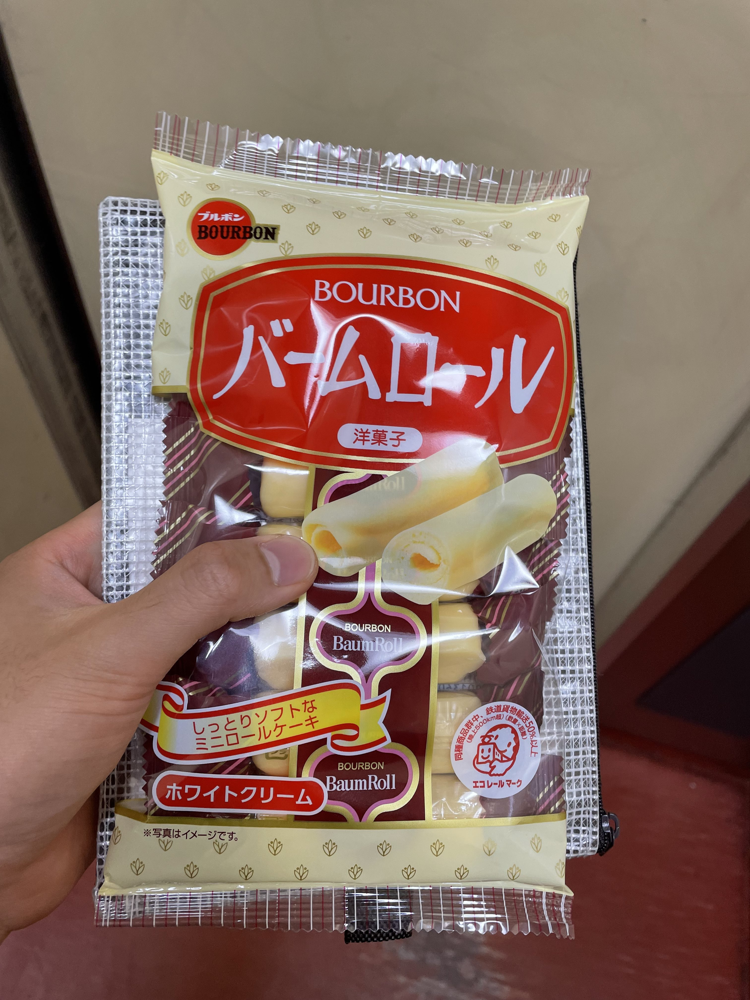

今日も暑かった。なんだかよくわからないが17:00頃の日差しがめっぽう強く良く言って灼熱地獄という趣がある。
帰宅即無の毎日だ。

このところ増幅回路について学びを深めようと思い色々と見ている。作品でマイクの入力をもっとちゃんと扱いたいと思ったからである。CQ文庫から出ている「続 理解しながら作るヘッドホン・アンプ」という本がけっこうわかりやすい。といいつつ表層的な部分をパラーと眺めているとなんとなくこんな事が言われているのだなあということが分かる程度で、まだ全然理解できていない。

ICCのプレスリリースが出た！こういうことではしゃぐのも恥ずかしいんですけど、やっぱりICCはずっとみてきたのでとても嬉しい。今までICCで見てきた人たちの中に自分の名前が並んでいるのがとても変な感じがする。CGコンで作品見ていただいたやんツさんと会えるだとか、ICCで働いてる大学院の同期の友達と今回一緒に仕事できるとか、色々とエモ事象が発生している。 続けるものですね。つづける、といっても全然継続的にやれてるわけじゃなくて、常に「やれてない」という状態を生きながらそれでもなんとかだましだましやっていく、というような感じであった。

BEAT/BITは分解とかしちゃっていて今のままでは展示できないので、色々と再制作したり改良していく必要がある。初めてのデカい展示でわからないことばかりですが、頑張っていきます。良い展示にしたいぞ。

プリンターがもうあんまり売ってないんだよな。前はaitendoとかでも売ってたんだけど。去年aliexpressで買ったものは仕様が違くて使えなかった。SwitchScienceで在庫が残り2個だったから買い占めた。結構高いんだよなあこれ。

家賃を大家さんのところに持っていったらバームロールもらった。画像でけ〜〜！！！！！！

