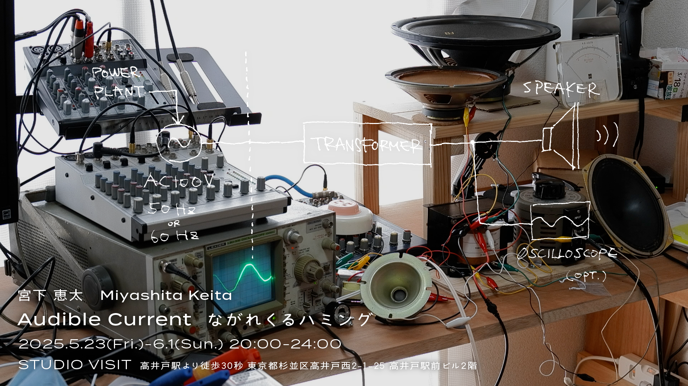

久しぶりに東京で展示をやります（個展はちょうど3年ぶり）！ 
高井戸のSTUDIO VISITという素敵なお店です。仕事帰りにビール飲みに来て！

—

宮下恵太「ながれくるハミング｜Audible Current」

📆 2025年5月23日(金)-6月1日(日)(会期中無休) 
🕰️ 20:00-24:00 (23:30最終入店) 
📍 STUDIO VISIT [@studio_visit_takaido](https://www.instagram.com/studio_visit_takaido/) （高井戸） 
🚶 高井戸駅より徒歩30秒 東京都杉並区高井戸西2-1-25 高井戸駅前ビル2階

—

宮下恵太はこれまで、情報や電気、通信といった現代のインフラとしてのテクノロジーに焦点を当て、特定の機能を持ったシステムを構築することによりテクノロジーと人間の関係性について考察してきました。およそ3年ぶりの東京での個展となる本展では、電力会社によって供給される交流100Vの商用電源を音として鳴らすための装置を通じて、私たちの日常に流れ続けている通奏低音としてのインフラを再び前景化させることを試みます。

協力：STUDIO VISIT

[https://www.instagram.com/p/DJBvD9Kyg9d/](https://www.instagram.com/p/DJBvD9Kyg9d/?img_index=1)
