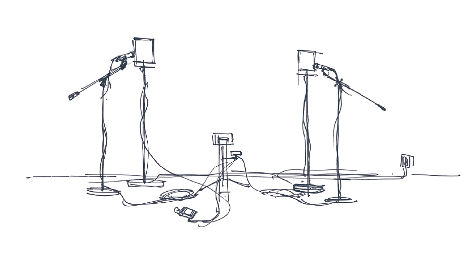

**2人のパフォーマーのための通信規約 / A Communication Protocol for Two Performers**

現代音楽家Steve Reichによる楽曲「Clapping Music」における手拍子のパターンを符号化された信号として再解釈し、通信規約（プロトコル）を設計する。そのプロトコルによって通信を行う通信装置を実装し、展示空間を通信路として実際に情報の伝達を行っている。

空間に設置された2台の送信機は、ステージ上で演奏を行う2人のパフォーマーのように、メトロノームが発するクリック音に合わせて音を鳴らす。その音はリズミカルな音楽、あるいは機械的な信号として空間の中に放たれる。それぞれの送信機に向けられたマイクはその音を電気信号へと変換し、受信機がそれらを元のメッセージへと複合する。複合されたメッセージへはプリンターへ送られ、我々が認識可能な文字として出力される。

新しい解釈者の実装によって、これまで音楽として自己目的的に聴取されてきた音は情報伝達という目的を持った信号と変化する。それと同時に、情報伝達を目的とした打音による信号は、（現時点では）プロトコルを共有していない私達にとっては音楽のように聞こえるかもしれない。

---

**プロトコルについて**

1. 手拍子のパターンを0と1によって表現する。
2. これらを1音ずつclap1, clap2の順に並べると24bit分の情報が得られる。
3. 8bit = 1byteずつ区切ると、1つのパターンにつき3byteの情報量を持つことがわかる。
4. 逆の手順により、任意の1byteのデータを手拍子のパターン4音分で伝達することができる。
5. ASCIIコードの対応する数値を送信することで、任意の文字列を伝達することができる。
6. 送信機・受信機間のタイミングの同期は外部のメトロノームの音を入力することにより行う。

sketch