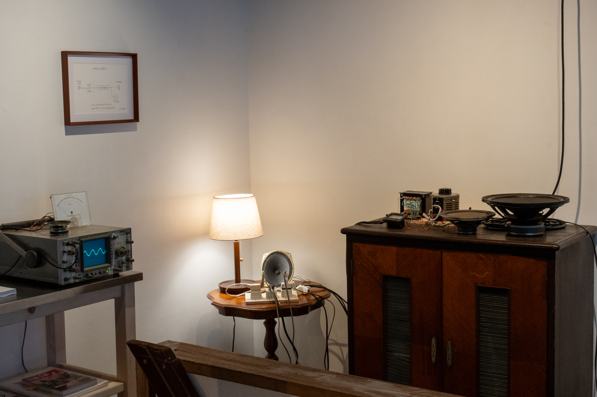
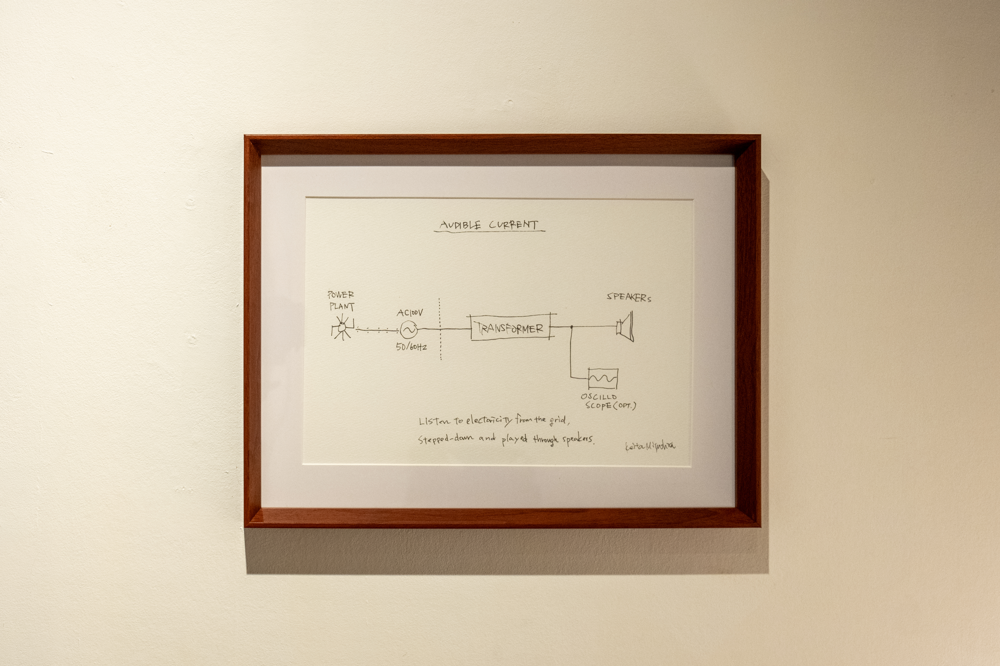
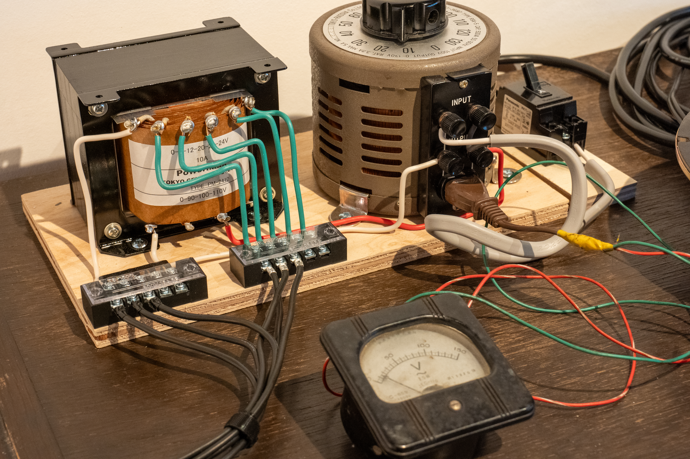
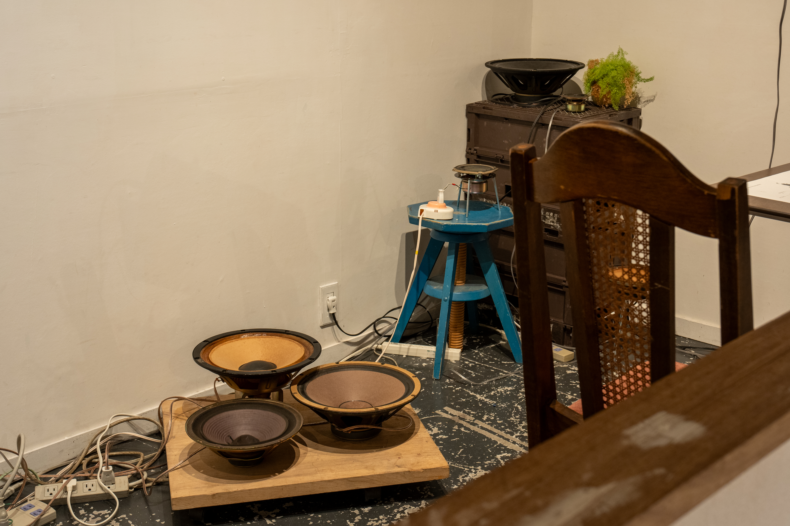
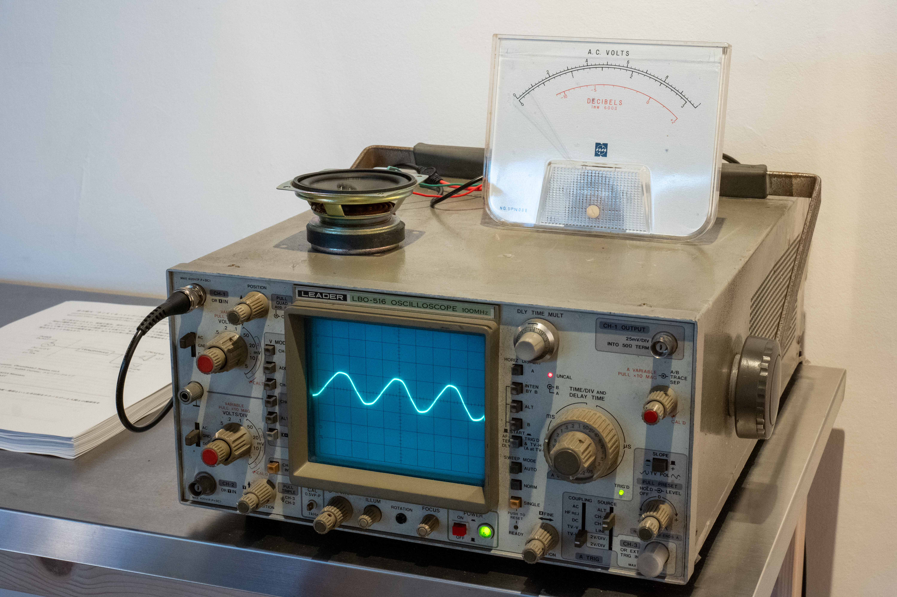
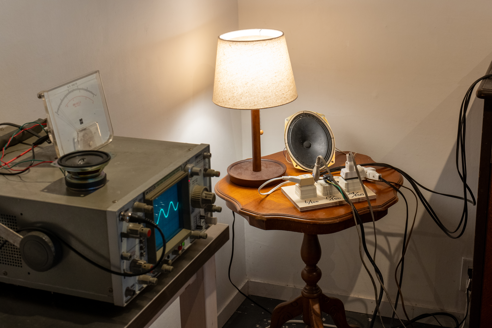
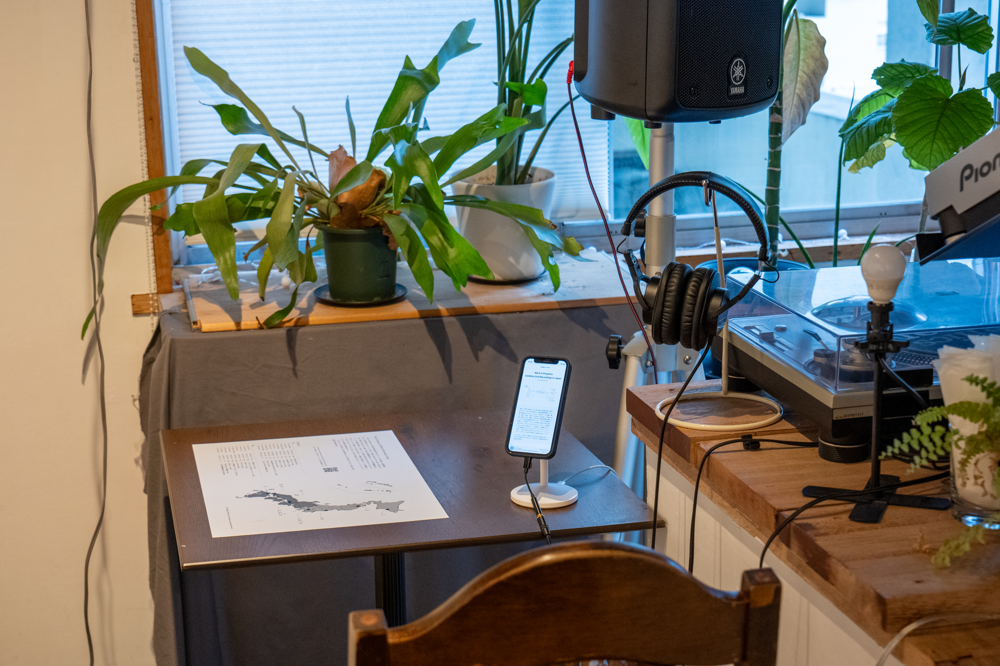
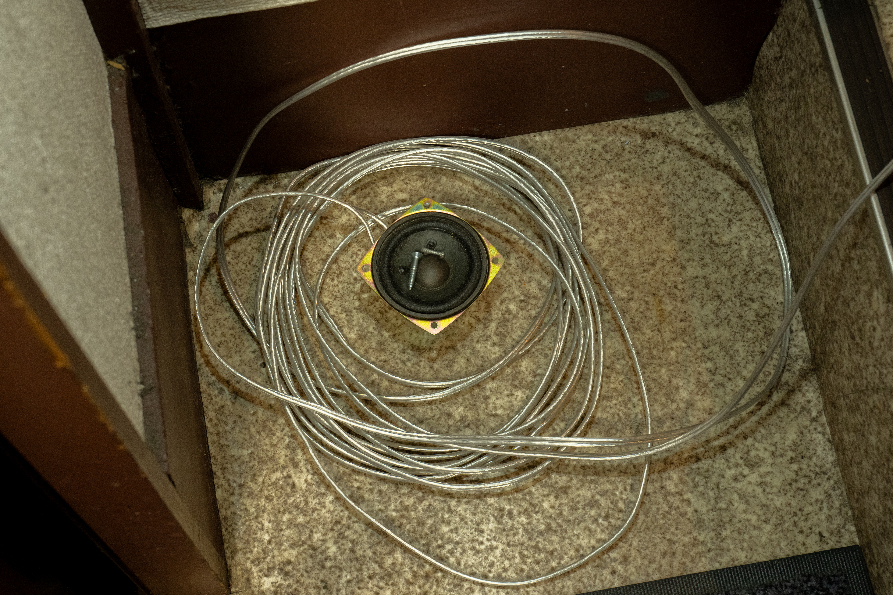
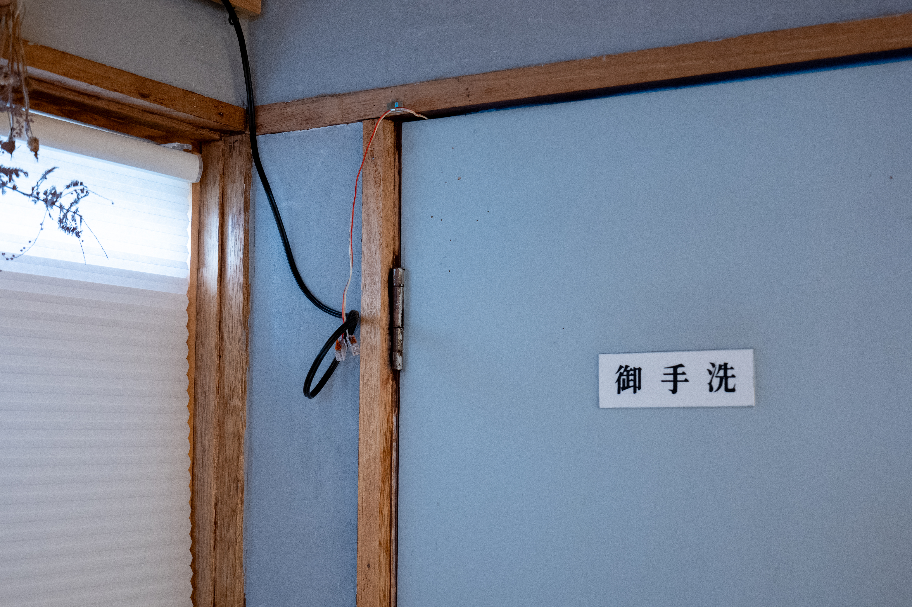
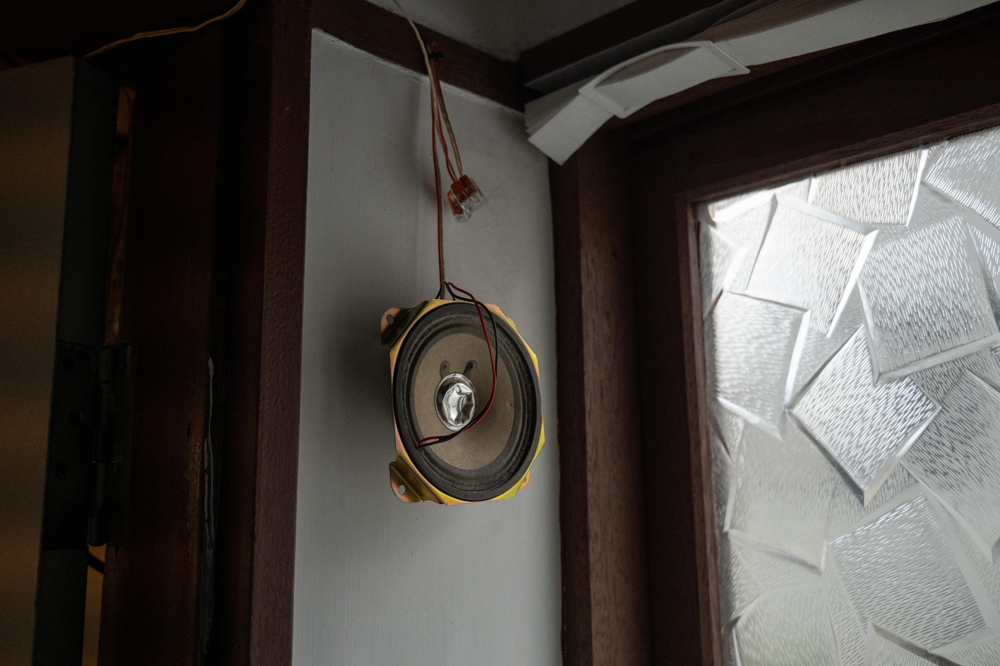

<iframe width="560" height="315" src="https://www.youtube.com/embed/LmIzV2iuNF4?si=drQKm0NfVlZ-zN_q" title="YouTube video player" frameborder="0" allow="accelerometer; autoplay; clipboard-write; encrypted-media; gyroscope; picture-in-picture; web-share" referrerpolicy="strict-origin-when-cross-origin" allowfullscreen></iframe>

商用電源、トランス、オシロスコープ、電圧計、スピーカー、電源タップ など 
サイズ可変

作者はこれまで、情報ネットワークや電気、通信といった現代のインフラとしてのテクノロジーに焦点を当て、特定の機能を持ったシステムを構築することによりテクノロジーと人間の関係性について考察してきた。本作品では、都市の電力供給網を巨大な音響装置として読み替え、どこか遠くの発電所で生成されたであろう正弦波を、空気の振動として聴くための装置、あるいはその振動そのものを作品として提示する。

展示空間には、スピーカーと複数の装置、それらを接続する配線が設置される。空間に点在するスピーカーは低い唸りのような音を絶えず発している。そのうちいくつかのスピーカーには物体が載せられ、振動に合わせてカラカラと音を立てる。各スピーカーには、2つのトランス（電磁誘導によって交流電圧を変換する装置）によって降圧された電気が送られ、その電力が電磁誘導によって膜の振動へと変換される。接続された電圧計やアナログ式オシロスコープは、その電気の揺らぎを視覚化する。商用電源AC100Vを音として鳴らすための装置を通じて、私たちの日常に背景に流れ続けている通奏低音としてのインフラをあらためて前景化させる試みである。

また、これまで各地で録音してきた、降圧された電気をレコーダーで収録した音源を聴くことができるシステムも同時に設置している。現在、日本では地方ごとに10の電力の供給区域に分割されており、それぞれの地域ごとの送配電事業者によって電力供給がなされている。また、東日本（＝北海道、東北、東京、中部、北陸）では50Hz、西日本（＝関西、中国、四国、九州、沖縄）では60Hzと電源周波数が異なっている。同じ周波数地域であっても、それぞれ発電所や送電ルートは異なっている。各地域での電力の質に違いはあるのか？あるとすればどのように？また、地域差よりも引き込まれた後のルートや接続された機器によるノイズの影響のほうが大きいのだろうか？そうした問いから継続して録音してきた音のうち、6つの供給区域・18地点での音源を視聴できる。これらの音源は現在もWEB上で公開している。 
[→https://www.keitamiyashita.com/audible-current/](https://www.keitamiyashita.com/audible-current/)

<section class="album-player">
    <iframe width="100%" height="450" scrolling="no" frameborder="no" allow="autoplay" src="https://w.soundcloud.com/player/?url=https%3A//api.soundcloud.com/playlists/2015685144&color=%2371aad4&auto_play=false&hide_related=false&show_comments=false&show_user=true&show_reposts=false&show_teaser=false&show_artwork=false"></iframe>
    

</section>

###### ステートメント

>作曲家／メディアアーティストの三輪眞弘は「中部電力芸術宣言」の冒頭で、「いついかなる時でも電気が必ず供給され続けることを前提として、人類が未来を考えるようになってから、ほぼ半世紀が経った」と述べ、電気文明における電気を利用した「装置を伴う／による表現」を「電力芸術」と呼んだ。この宣言が公開されて10余年が経つ現在、この前提は変化しつつあるだろうか？
>
>1889年、ニコラ・テスラが設計した多相交流システムをもとに開発された発電機が、大阪電燈株式会社によって日本に導入され、国内で初めて交流方式による配電が開始された。以後、戦後の復興、高度経済成長や東京オリンピック／大阪万博といった日本の「進歩」の歴史とともに、電気は我々の生活の隅々にまで浸透していった。
>
>音もまた、社会が電化する過程で変容を遂げた。音響メディア技術の発展により、音は電気信号へと変換され、回路を通じて記録・再生されるものとなった。蓄音機、ラジオ、アンプ、スピーカー──そうした装置によって、 音は空気の振動であると同時に、回路上を流れる電気の振動となった。それに伴い、音楽も電気によって加工され、保存され、伝達される対象へと変化していく。今や、音楽と呼ばれるもののほとんどが電気を介して生成／増幅され、聴かれている。 
>
>現在、東日本では50Hz、西日本であれば60Hzの交流電流が、張り巡らされた電力網の中を常に流れ続けている（50／60Hzをめぐる不可視なボーダーに関しては、また別の機会に取り上げようと思う）。その波形はタービンの回転運動から生み出される正弦波であり、倍音を含まない単一の周波数による振動である。「純音」とも呼ばれるこの波形は、音の最も基本的な要素といわれ、テストトーンや測定信号として広く使われている。私たちの電化した暮らしのすぐ裏側には、このような、鳴らざる音がすでに流れ続けている。
>
>本展では、都市の電力供給網を巨大な音響装置として読み替え、どこか遠くの発電所で生成されたであろう正弦波を、空気の振動として聴くための装置、あるいはその振動を作品として提示する。送電線から屋内へと引き込まれた電気は、分電盤を通り壁のコンセントへ到達する。コンセントに接続された２つのトランスによって降圧した電源を、家庭用の電源タップなどを介してスピーカーへ分配する。スピーカーのコイルへと流れ込んだ交流電流は、電流による磁束と永久磁石とが生む電磁誘導の働きによってコーンを震わせ、空気の振動へと変換される。無意識のうちに消費される電流と同じように、空間に放たれた音もまた、時に私たちの鼓膜を揺らすことなく消失する。
>
>電力会社から供給され続けるAC100Vの電気を鳴らしてみる。ただそれだけの事なのだが、その振動には、見えない都市の営みや産業構造、あるいは音そのものや聴取に対する様々な問いが含まれていると感じている。それは終わりのない通奏低音なのか？まったくの無音が訪れることを私たちは想像できるだろうか？
>
> 宮下恵太

