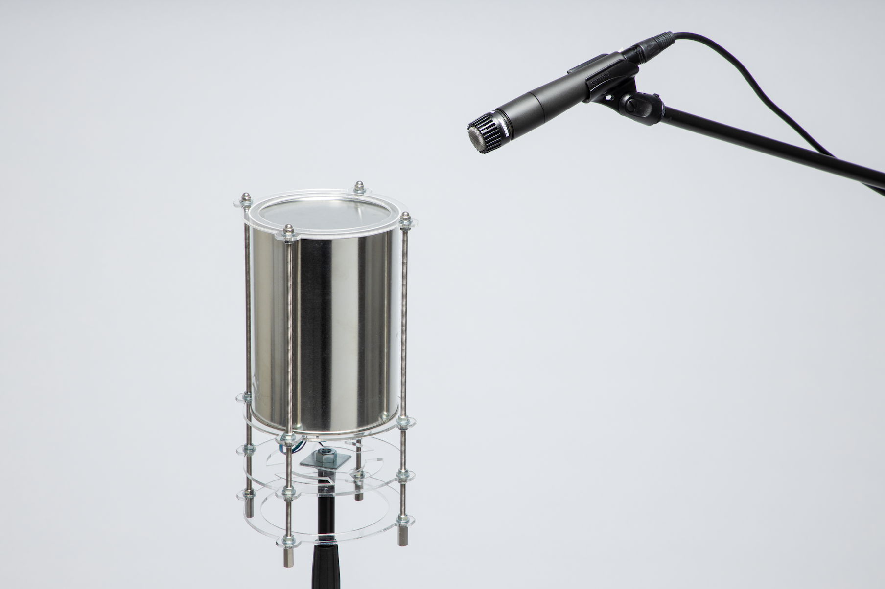
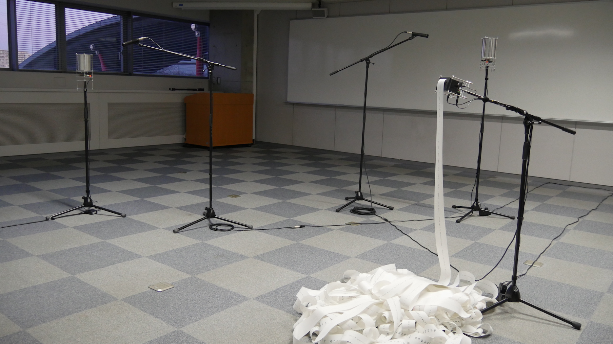
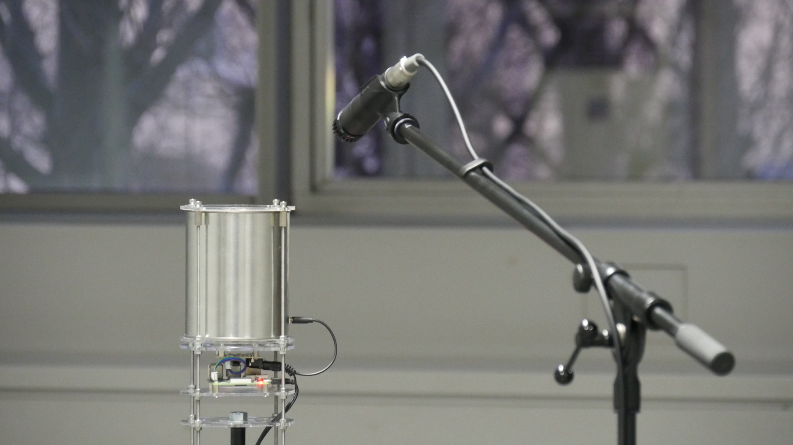
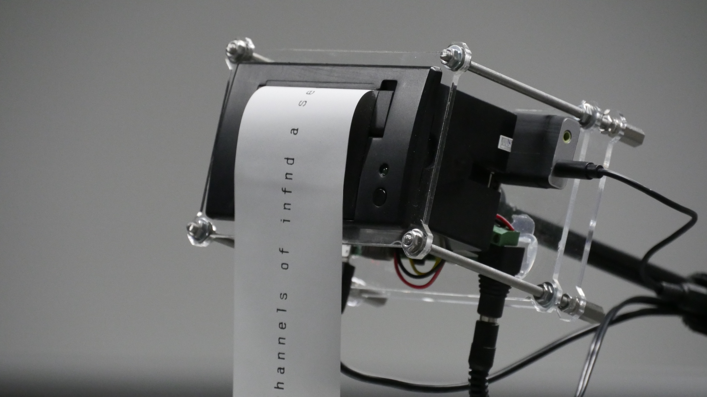

コンピュータにおいて、あらゆる情報は基板上を流れる電圧の高低、0と1のバイナリによって表現される。本作品はコンピュータで扱われる電気信号の0と1をソレノイドの運動に置き換え、物体を叩くことにより情報の伝達を行う通信端末装置及びそのシステムからなるインスタレーション作品である。 本来人間には知覚することのできない電気信号-bitを、打音という身体的な信号-beatに置き換え知覚化することで、より直接的に人間がデジタル情報への干渉を行っていく可能性を提示している。
2020年度アジアデジタルアート大賞学生カテゴリーインタラクティブアート部門にて優秀賞を受賞。第26回学生CGコンテストアート部門ノミネート。

This work is composed of communication devices that transmits information by sound of hitting things and a series of communication systems. The communication devices includes a transmitter and a receiver. The transmitter equips a metal can and a control circuit board. The can has a solenoid controlled by a microcontroller on the board. When the microcontroller receive binary data, the solenoid bangs on the can according to the order of 0 and 1, and sends a signal. A microphone connected to the receiver picks up the sound and converts it to an electrical signal. A computer mounted on the receiver processes the received audio signal and decodes the original binary data.

metal can, solenoid, microphone, raspberry pi, micro controller, circuit board, thermal printer, acrylic plate

▲2020年2月8~10日に開催された首都大学東京インダストリアルアート学科卒業・修了制作展での展示の様子

