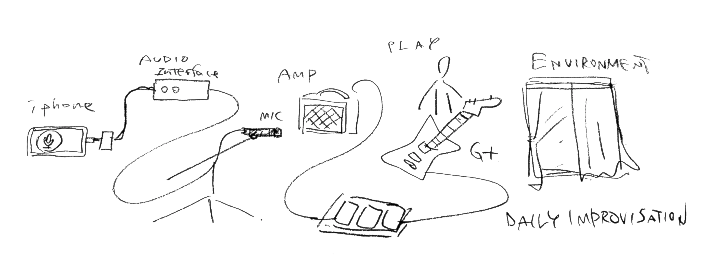

2021年の8月25日から9月17日までの間、自宅で2-3分程度の即興演奏を行い、オーディオインタフェースとマイク、iPhoneを用いそれを記録した（できない日もあった）。録音した演奏はその日に撮影した写真とともにSoundCloud上にアップロードした。
<!-- 
<iframe width="100%" height="450" scrolling="no" frameborder="no" allow="autoplay" src="https://w.soundcloud.com/player/?url=https%3A//api.soundcloud.com/playlists/1308510553&color=%23ff5500&auto_play=true&hide_related=false&show_comments=true&show_user=true&show_reposts=false&show_teaser=true"></iframe>
<a href="https://soundcloud.com/user-398675347-63564957" title="koma" target="_blank" style="color: #cccccc; text-decoration: none;">koma</a> · <a href="https://soundcloud.com/user-398675347-63564957/sets/daily-improvisation" title="Daily Improvisation" target="_blank" style="color: #cccccc; text-decoration: none;">Daily Improvisation</a>
 -->

--

>夏の間の少しの期間、毎日少しづつギターを弾いたのを録音する、ということをした。机の横に立てかけてあるギターを手に取り、その時の気分で音を鳴らす。誰かに聞かせるというよりは、日々の自分のコンディションを確かめるために。
>
>演奏を続けることで、木材と6本の弦が振動することについてだんだんとわかっていく。自分のからだの一部になっていく。そうすると、自分のからだの一部であるギターを通して外の世界を感覚することができるようになっていく。無機質な物体が弦とこすれる感覚。アンプから出た音が部屋の中の空気と混じり合う感覚。そうした感覚によって、私の身体は拡張される。
>
>雑音と楽音の間を行ったり来たりしながら、どこへ向かうでもなく歩く。私にとって、即興は散歩に似ている。同じ道を歩くたび街と自分の距離が縮まっていく。スニーカーのソールの厚みによって足の裏と地面の関係が少し変化することや、道端に置いてある石が時折少し移動していることに気づく。同じ道を歩いていてもその時々で考えることは異なる。
>
>我々は目的を持たない即興的な「散歩」によって街との関係性を構築してゆく。同じように、即興演奏とは目的を持たずに楽器に触れることで、自分の身体と楽器、その周辺との関係性を構築していく行為なのではないかと思う。

