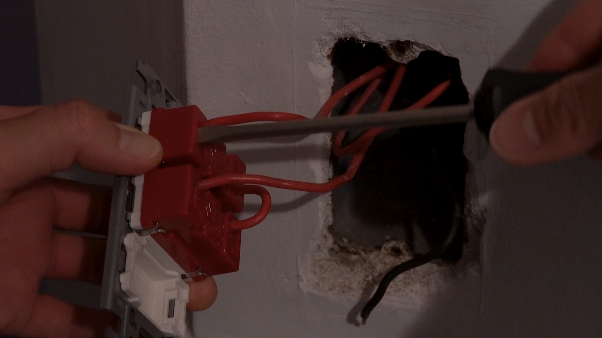
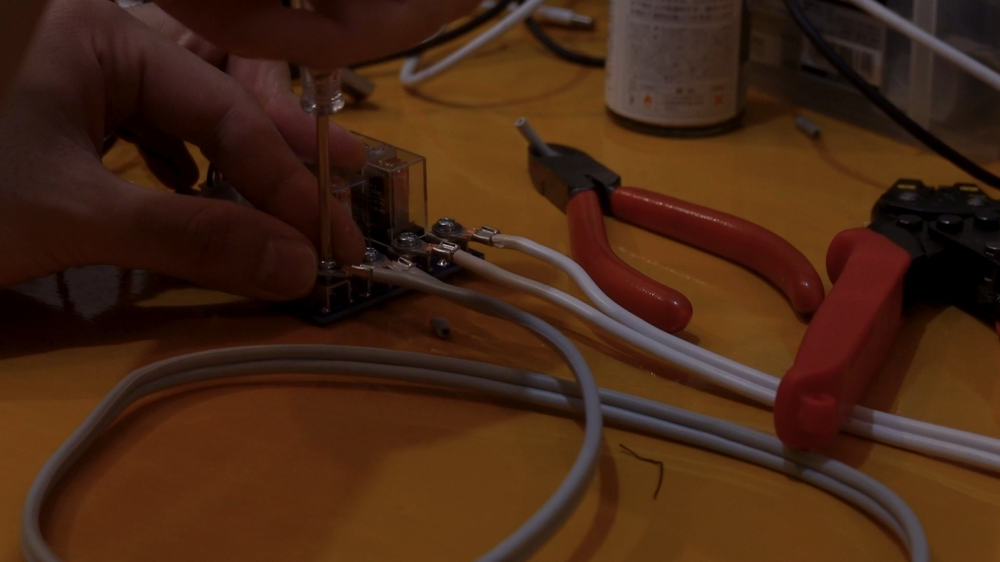
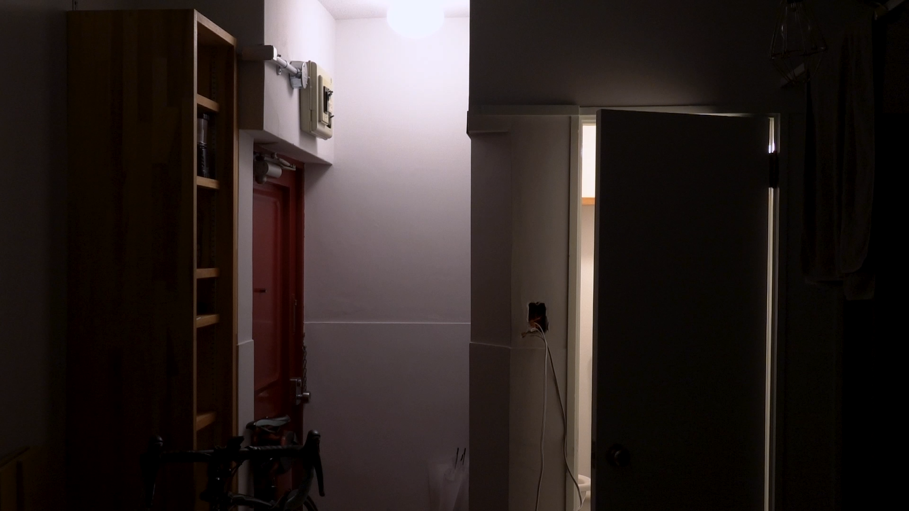
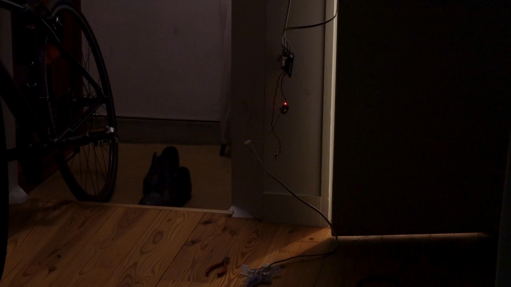
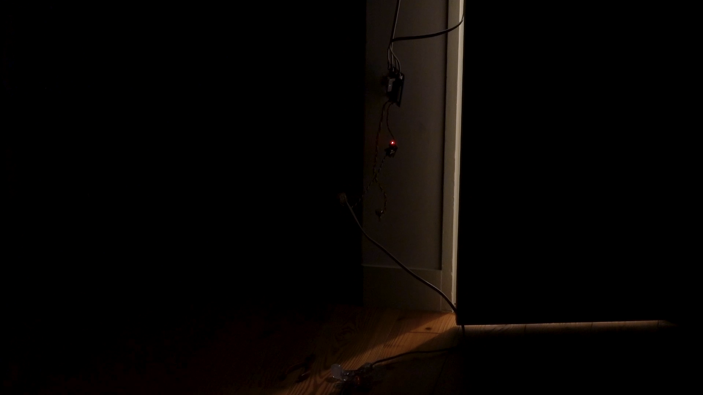

<iframe width="560" height="315" src="https://www.youtube.com/embed/9gscVlS31B0" title="YouTube video player" frameborder="0" allow="accelerometer; autoplay; clipboard-write; encrypted-media; gyroscope; picture-in-picture" allowfullscreen></iframe>

自宅の電気配線をハックし、Steve ReichのClapping Musicを演奏する様子を記録した映像作品。
隣り合う玄関とトイレの照明のスイッチに自作の基板を取り付け、家そのものを演奏装置として利用する。それぞれの照明はパフォーマーとして譜面の指示通りに明滅を繰り返す。
DIY的技術を用いて生活空間や電気というインフラへの介入を行い、音楽作品を空間へのインストールという形でリアライズすることで、我々の生活やそれを支えるテクノロジーと、音楽や制作の関係性について考える。

素材　家、自作基板
形態　映像（5分23秒） / インスタレーション / パフォーマンス

--- 

1. 手拍子をする。手のひらと手のひらがぶつかり合い、空気が圧縮される。圧縮された空気が隙間から勢いよく漏れ出ることによってパン、という破裂音が生じる。人間が道具を使わずに音を鳴らすときによく行われる行為の一つだ。人はこれを使ってリズムを生み出したり、音楽を演奏したりすることもできる。

2. リレーを使って照明のスイッチを入れるときのことを考える。一次側のコイルに電流を流すと、電磁力によって接点がコイル内の鉄心に引きよせられる。その動きによって二次側のスイッチの接点同士が接触し、カチッ、という音が鳴る。スイッチが閉じることにより回路に電流が流れ、照明が点灯する。このとき、音は照明の点灯によって鳴っているのではなく、スイッチの接点の物理的接触によるもので、照明の点灯の過程で鳴ってしまうノイズのようなものだ。

3. 日本では無資格者が自宅のコンセントやスイッチを取り外したり増設することは電気工事法により禁じられている。現在最も重要なインフラのひとつである電気は、大部分の人々にとっては毎日使用しているにもかかわらず見ることも触ることもできないものだ。普段の生活の中で、家の壁一枚隔てたところにある張り巡らされた配線について意識することはほとんどない。

4. 電気設備として生活に埋め込まれた「音楽」は、電気の供給が続く限り終わることはない。が、電気の供給は様々な方法により止めることができる。災害や電力不足による停電や転居による契約の解除、あるいは電気料金の滞納によって。

PCB for clapping music ver.1 and 2