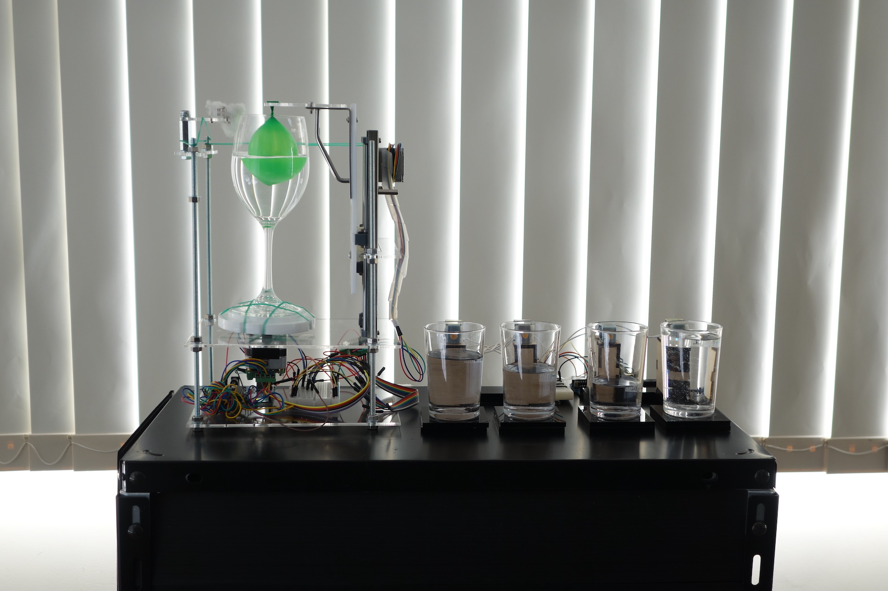
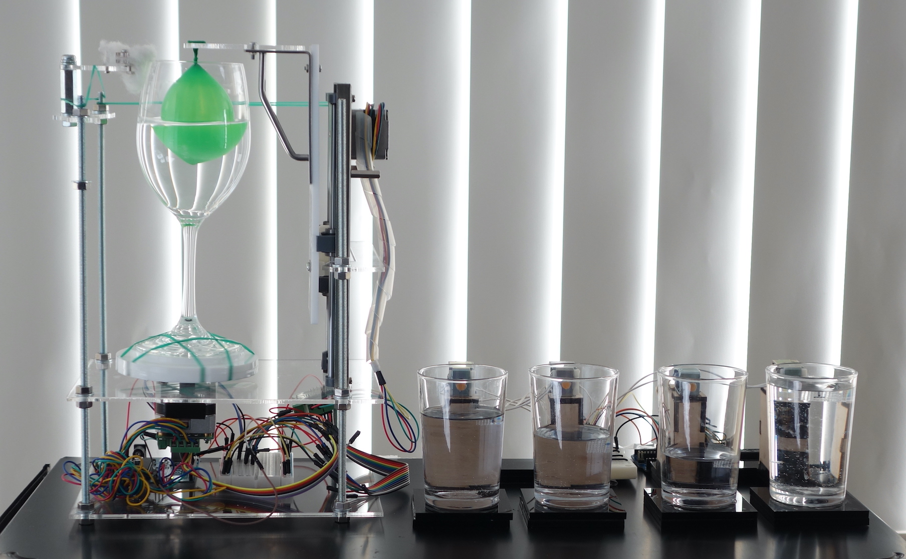
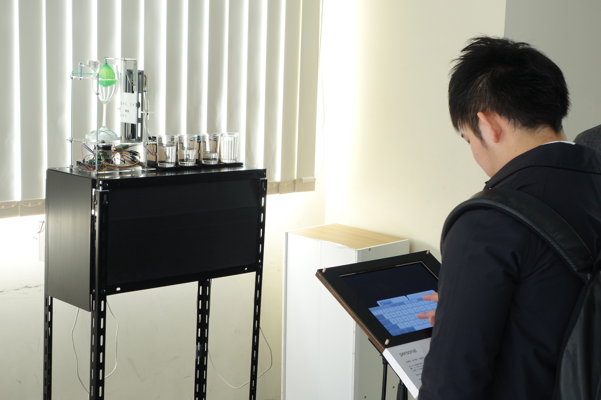

グラスハープの原理を用いた可聴化機。グラス内に浮かんだ水風船を上下させることで水位を変化させ、音程を制御する。
本来人間が知覚することのできない情報などを音に変換し聴くことができるようにすることを、可聴化やソフィケーションと呼ぶ。 本作品は連続的な音の変化をコンピュータによって電気的に発生させるのではなく、物理的な発音原理を用いて情報の可聴化を行うデバイスである。
このデバイスを用い、鑑賞者の生体情報を音に変換して聴くことのできるサウンドインスタレーション作品「Personal」として中原貴文との共同制作を行い、インターカレッジ・ソニック・アーツフェスティバル2017にて展示を行った。

glass, baloon, stepping motor, arduino, aclyric plate, water

<iframe title="vimeo-player" src="https://player.vimeo.com/video/434839533?h=3ef9f6a6a3" width="640" height="360" frameborder="0" allowfullscreen></iframe>

<iframe title="vimeo-player" src="https://player.vimeo.com/video/436865392?h=9052c66f44" width="640" height="360" frameborder="0" allowfullscreen></iframe>