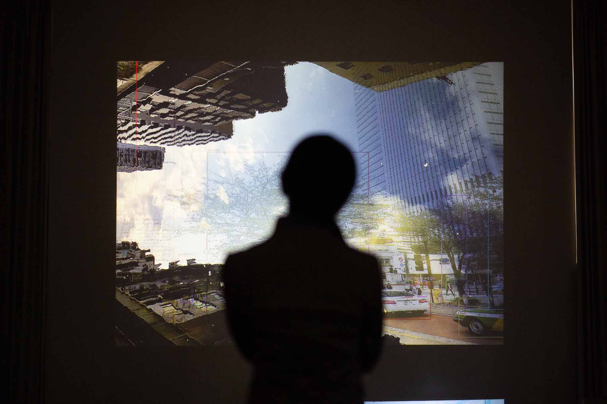
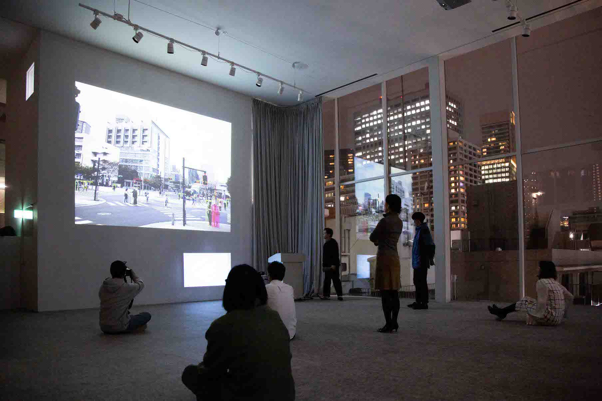
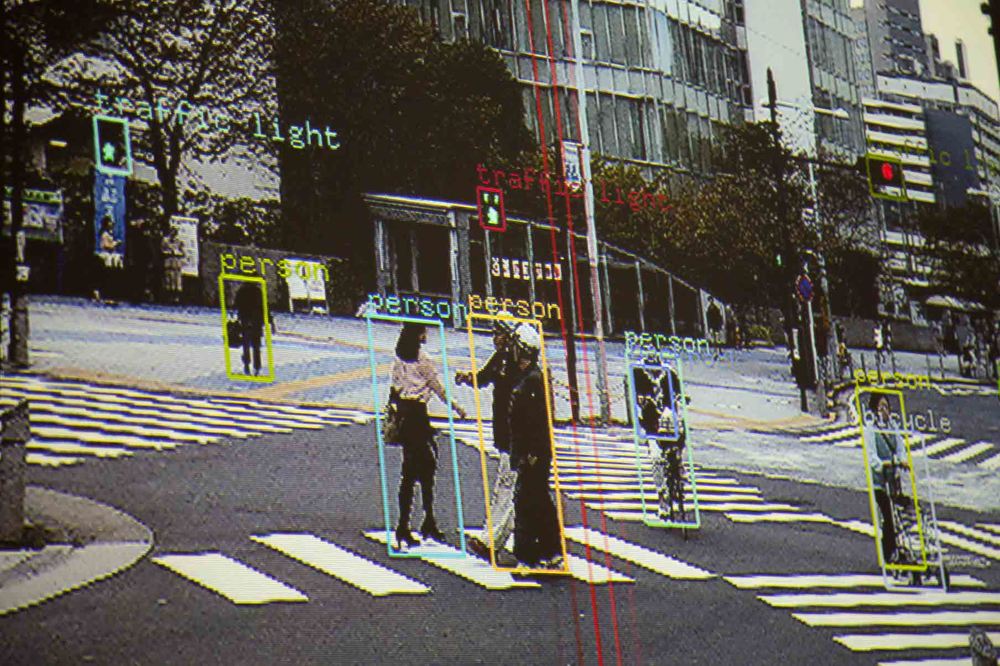

サウンドアーティスト田中堅大の作品「Is the City Ours ?」において、物体検出ライブラリであるYOLOを用いたアノテーションシステム/ミュージックシーケンサシステムの開発を担当した。

一般市民と協働で都市の環境音／画像／動画を採集し、それらを時間上に配置することで、都市の視-聴覚的なイメージから音楽を作曲する試み。東京の都市・芝浦でフィールドワーク及びフィールドレコーディングを実施し、都市の素材を採集し、その後一般市民と協働で都市の素材を再構成することで、都市からの作曲＝「都市作曲」を試みた。本作品は、建築家／都市景観デザイナーである韓亜由美が主宰する「まちはだれのもの 2018」のStudio 03「まちをきく」の一貫として制作され、2018年11月25日に芝浦ハウスで展示された。

This sound installation aimed to aurally and visually recompose the city with citizens. As a part of a workshop series “Cityours”, we conducted fieldworks and field recordings for gathering urban materials(environmental sounds and photographs) at Shibaura, Tokyo. Then, Kenta Tanaka conducted “Urban Composition” by recomposing the urban materials of Shibaura with the workshop participants. His question is how would we re-experience the image of the city by means of participatory processes.

( Kenta Tanaka | Urban Composition#01 - Is the City Ours? より引用 )

