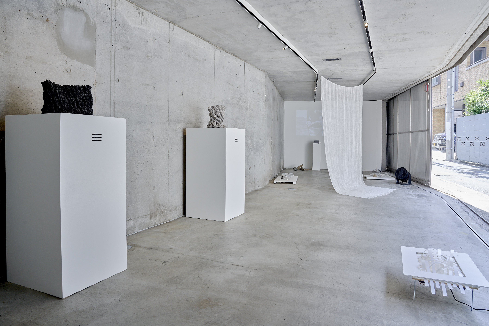
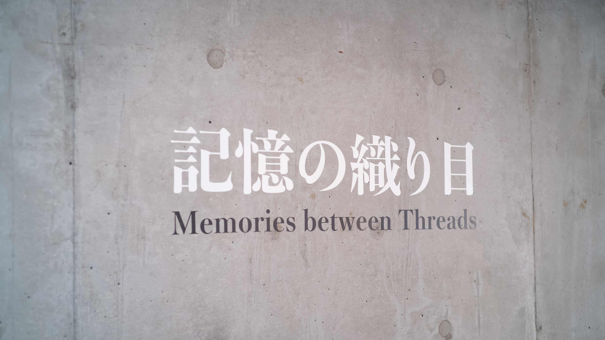
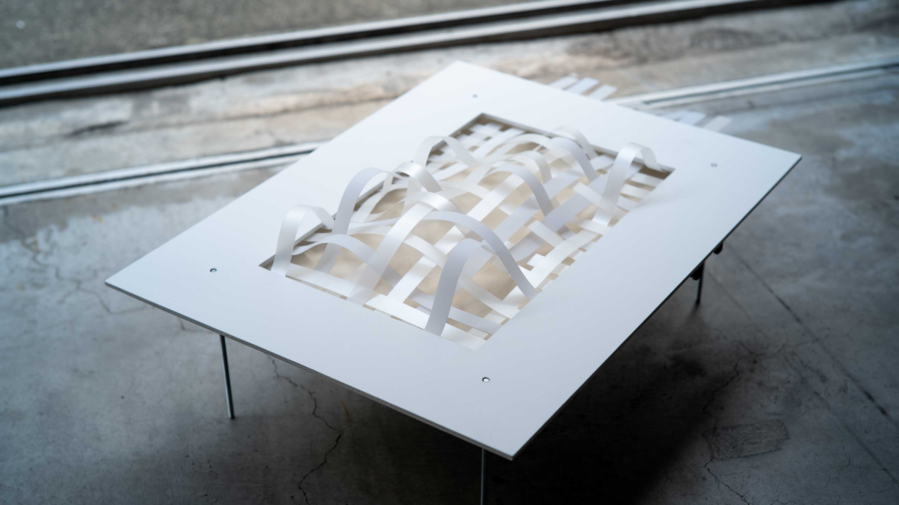
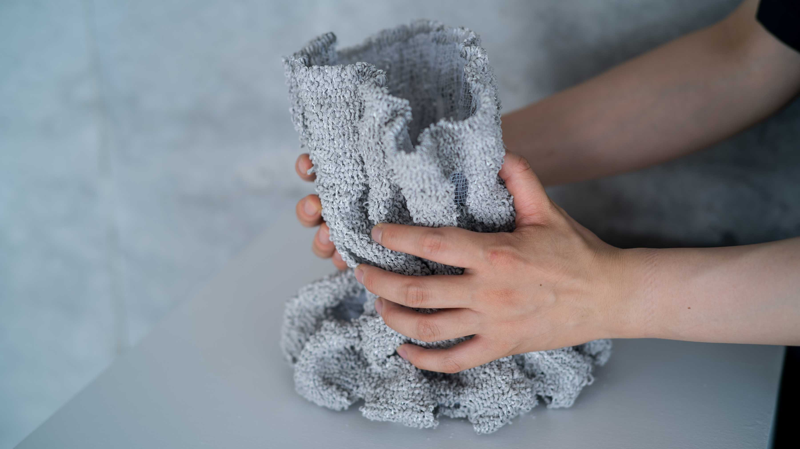

2021年9月3日(金)～2021年9月10日(金)に開催された展示会 記憶の織り目｜Memories Between Thread において、展示全体のテクニカルディレクション/エンジニアリングを行いました。











```
記憶の織り目
2021年9月3日（金） - 9月10日（金） 14:00 - 19:00
Sta. @sta.official ｜ 〒150-0044 東京都渋谷区円山町11-7

レビエ・レベッカ——デザイナー
田中堅大——サウンドアーティスト／都市音楽家
肥田野優希——テキスタイルデザイナー
宮下恵太——サウンドプログラマー／エンジニア
ミヨン・エデン——写真家／テキスタイルデザイナー
—
柴田有紀——ガラスアーティスト ［制作協力］
志田真菜実——ガラスアーティスト ［制作補助］
林明佳——グラフィックデザイナー ［什器・設営協力］

-

Memories between Threads
September 3rd - 10th, 2021 | 14:00 - 19:00
Sta. ｜ 11-7, Maruyama-chou, Shibuya-ku, Tokyo

Rebecca Rébillé——Designer
Kenta Tanaka——Sound Artist
Yuki Hidano——Textile Designer
Keita Miyashita——Sound Programmer/Engineer
Eden Millon——Photographer/Textile Designer
—
Yuki Shibata——Glass Designer [Production Cooperation]
Manami Shida——Glass Designer [Production Cooperation]
Asuka Hayashi——Graphic Designer [Exhibition Cooperation]
```