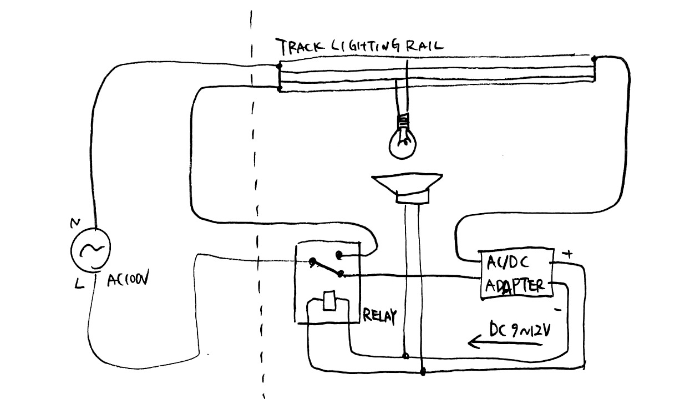

メカニカルリレー、ACアダプター、スピーカーユニット、白熱電球といった日常的に使用される電気装置と展示室の外部から供給される100Vの交流電源を直接接続し、発振回路を構成している。壁の裏側を走る100Vの商用電源と電源装置としてのACアダプタ、あらゆる制御回路に組み込まれる部品であるリレーからなる発振回路が引き起こす電気的振動は、回路に接続された白熱電球やスピーカーユニットによって光や音、熱、動きといった知覚可能な現象として表れる。「閾（いき、しきみ）」とは門の敷居を指す言葉であり、内側と外側とを区切る境界を表す。

2023年7月20日から8月1日の間、九州大学芸術工学図書館映像音響ラウンジにて展示を行った。

The electronic oscillator is comprised of everyday electronics—mechanical relays, speaker units, incandescent light bulbs, and an AC adapter, all powered from an exterior 100V supply. With the 100V supplied from behind the wall via AC adapter, the electrical vibrations caused by the electronic oscillator via the relay—a component found in all control circuits—the incandescent bults and speaker units connected to the circuit create light, sound, heat, and movement. Iki (閾) is a word that denotes a gate of entry, a boundary point, or threshold, between interior and exterior.

